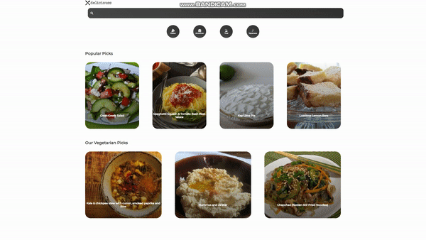

## Deliciouss

 

 
 

    
        
        
    

 

## 🏠 [Deliciouss](https://monumental-rolypoly-fb2e03.netlify.app/)

 

🍕세계 여러나라의 대표 음식의 레시피를 검색할수 있는 앱입니다.

 

 

## 📌 주요 기능

| [🔗 레시피 ](https://github.com/jackma914/react-recipe-app/wiki/%F0%9F%93%8C-%EB%A0%88%EC%8B%9C%ED%94%BC) | [🔗 레시피 검색](https://github.com/jackma914/react-recipe-app/wiki/%F0%9F%93%8C-%EB%A0%88%EC%8B%9C%ED%94%BC-%EA%B2%80%EC%83%89) | [🔗 카테고리 ](https://github.com/jackma914/react-recipe-app/wiki/%F0%9F%93%8C-%EC%B9%B4%ED%85%8C%EA%B3%A0%EB%A6%AC) |
| :------------------------------------------------------------------------------------------------------------: | :-------------------------------------------------------------------------------------------------------------------------------------------------------: | :---------------------------------------------------------------------------------------------------------: |
|                                                                    |                                                                                                                     |                                                                     |

 

## 📌 History
